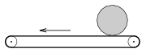

I bought a cylinder shaped piece of cheese in a shop. At the cash-desk I put it onto the conveyor belt such that its horizontal symmetry axis was perpendicular to the rim of the conveyor belt. When the conveyor belt began to move the cheese also began to move. What was the speed of the centre of the cheese, if the speed of the conveyor belt was 60 cm/s?

 (5 pont)

