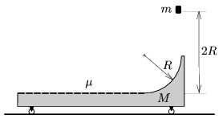

A frictionless slope, having a cross section of a quadrant of radius R =20 cm, is attached to a moveable cart as shown in the figure. The horizontal surface of the cart is rough, the coefficient of friction is =0.8. A point-like object falls freely from a height, measured from the plateau of the cart, of h =2 R onto the top of the slope, and arrives tangentially. It slides along the path and just stops at the end of the cart. How long is the cart?

 (5 pont)

