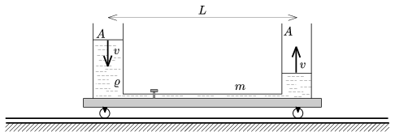

Two cylinder shaped vessels of cross section A are fixed vertically to a trolley, which was initially at rest. The two vessels are connected with a thin horizontal tube which is equipped with a tap. The distance between the axes of the vessels is L . The vessel in the left hand side is filled with some liquid of density ; and at this time the total mass of the system at rest is m .

 After opening the tap what is the speed of the cart at the moment when the speed of the water levels in the vessels is v ? (Rolling friction, friction in the bearings and air-drag are negligible.)
 (5 pont)

