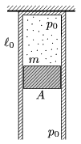

The top part of a thermally insulated, vertical cylinder of cross section A =0.5dm$^{2}$ is fixed. There is a sample of Helium gas in the cylinder and initially its pressure is p $_{0}$=10$^{5}$ Pa, its length is $_{0}$=50 cm. The bottom part of the cylinder is closed with an initially fixed thermally insulating piston of mass m =10 kg. The external air pressure is also p $_{0}$. Then the piston is released, and it can move frictionlessly in the cylinder.
 a ) What is the length of the helium confined in the cylinder when the speed of the piston is maximum?
 b ) What is the maximum speed of the piston?
 c ) What is the greatest length of the confined gas?

 (5 pont)

