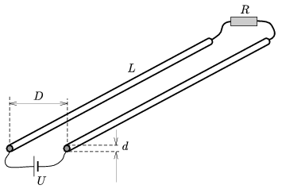

Two alike long, straight wires of diameter d , are at a distance of ; their resistance is negligible and ( L D ). One ends of the wires are connected through a battery of voltage U , and the other ends of the wires are connected through a resistor of resistance R . What is the value of R if the electric and magnetic forces exerted between the wires are equal?

 (6 pont)

