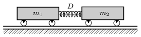

There is a spring of spring constant D =240 N/m between two easily rolling carts of masses m $_{1}$=2 kg and m $_{2}$=3 kg. The spring is kept at a compressed position by a thin thread and the compression of the spring is =15 cm. The common speed of the two carts is v =2 m/s. What will their velocities be after the break of the thread?

 (4 pont)

