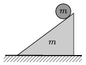

The height of the slope shown in the figure is 30 cm, and its base is 40 cm. A solid cylinder of uniform density, which has the same mass as the slope, rolls down along the slope without slipping. What is the least value of the coefficient of friction between the inclined plane and the horizontal ground if the slope does not slip?

 (6 pont)

