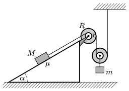

The coefficient of static friction between the fixed inclined plane of angle of inclination and the block of mass  M , shown in the figure, is  . The radii of the two alike pulleys are r and R ( R > r ), there is no friction at the axles, and the mass of the pulleys is negligibly small with respect to the other masses. Two pieces of rope are vertical, and one is parallel to the slope. The mass of the block at the bottom is  m . At what m / M mass-ratio can the system be in equilibrium?
 Data: =30$^\circ$, =0,2 and .

 (4 pont)

