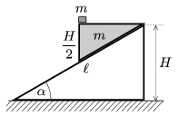

A right triangle shaped wedge of mass m =0.5 kg and of angle 30$^\circ$ is placed to the top of a fixed slope of length =1.8 m, and of angle of elevation =30$^\circ$, as shown in the figure. The vertical height of the wedge is exactly half of the height of the slope  H . The wedge is loaded with the small block of mass m as shown in the figure.
 This system is assembled in two samples. In case of one of them the small block is fixed to the wedge and in the other case the block is not fixed. The two wedges are released from rest at the same time. Friction is negligible at any surfaces.
 a ) Determine the ratio of the times during which the wedges reach the bottom of the slopes.
 b ) What are the forces exerted by the small blocks on the wedges in the two cases?

 (5 pont)

