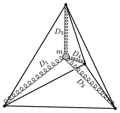

An astronaut in the International Space-station attaches himself to the four vertices of a regular tetrahedron shaped frame with 4 springs. The mass of the springs and their rest length are negligible, their spring constants are D $_{1}$=150 N/m, D $_{2}$=250 N/m, D $_{3}$=300 N/m and D $_{4}$=400 N/m. - For the sake of simplicity - the astronaut is considered pointlike, its mass is m =70 kg. What is the period of the oscillation of the astronaut if he is displaced from his equilibrium position and released?

 (6 pont)

