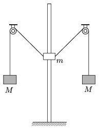

A pointlike object of mass m is able to move up and down on a vertical fixed rod. There is a vertical hole at the centre of the object, and the rod fits into this hole, such that the object can slide along the rod frictionlessly. Two pieces of thin light threads are attached to the object, and initially the angle between both threads and the vertical is =45$^\circ$. Each thread goes through a pulley, which are at the same height, and at the other end of each thread an object of mass M =1 kg is tied. The system is released from rest.

 a ) What is the mass m of the object on the rod, if after releasing the system it stops at the position where the threads attached to it are horizontal?
 b ) What is the acceleration of the object of mass  m when it starts to move back, and what is the acceleration of the other two objects of mass  M , when they start to move back?
 (4 pont)

