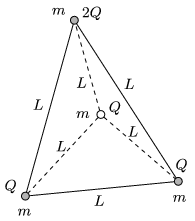

There are 4 positively charged small balls of mass  m at the vertices of a regular tetrahedron of edges  L . The balls are connected with insulating threads of negligible mass. Three balls have a charge of  Q , and the fourth is charged to 2 Q .

 a ) At the same instant the three threads which connect the charge of 2 Q with the others are cut. Determine the initial acceleration of the balls at the instant when the threads are cut.
 b ) To what speed will the balls accelerate?
 (5 pont)

