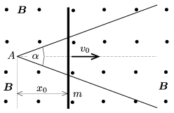

There are two conducting wires of negligible resistances in a horizontal plane enclosing an angle of  . A long enough rod of mass  m is placed onto the wires, perpendicularly to the angle bisector of the angle between the wires at a distance of  x $_{0}$ from the intersection A of the two wires as shown in the figure. The resistance per unit length of the rod is  r . The arrangement is put into uniform vertical magnetic field of magnetic induction  B .

 The rod is given an initial velocity of  v $_{0}$ in the direction of the angle bisector. The electrical contact between the wires and the rod is good, but the friction is negligible between them. Where will the rod stop?
 (5 pont)

