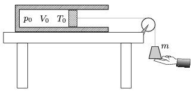

An easily moveable, thermally insulated piston of negligible mass confines a sample of air of volume V $_{0}$=8 litre, at a temperature of T $_{0}$=300 K, into a thermally insulated cylinder of cross section A =1dm$^{2}$. The cylinder is fixed to a horizontal table. The pressure of the confined air is the same as the atmospheric pressure p $_{0}$=10$^{5}$ Pa. A piece of thread is attached to the centre of the piston, it lies in the line of the axis of the cylinder and leads through a pulley. A weight of mass m =25 kg is attached to the other end of the thread as shown in the figure. Holding the weight, any part of the thread is straight, but loose.

 The weight is released without any push. To an accuracy of 1% determine the
 a ) temperature of the air in the cylinder, when the weight is at its lowermost position;
 b ) the acceleration of the piston at the lowermost position of the weight;
 c ) the greatest speed of the piston during the process. (The mass of the thread and the pulley and friction are negligible.)
 (5 pont)

