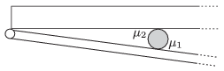

In order that the draught does not slam the door, a flat cylinder shaped object is placed between the door and the threshold, preferably close to the hinge of the door. The symmetry axis is of the cylinder is vertical. To what angle can the draught close the door if the coefficient of kinetic friction between the door and the object is $_{1}$ and that of between the object and the threshold is  $_{2}$?

 (5 pont)

