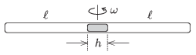

Both ends of a horizontal thin tube are closed. There is a mercury thread of length h at the middle of the tube. The length of the air columns in both parts is  , and the pressure of both air columns is equal to the gauge pressure of a mercury column of height  H . The tube is placed to a tumble dryer, the symmetry axis of which is vertical, and the tumble drier is started to spin.

 Give the displacement of the mercury thread as a function of the angular speed  , if the temperature is constant.
 (5 pont)

