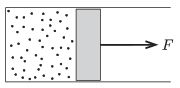

There is a sample of ideal gas in a cylinder shaped container. The symmetry axis of the cylinder is horizontal and at one end it is closed by frictionlessly moveable piston. Initially the volume of the gas is  V $_{1}$, its temperature is T $_{1}$ and its pressure is  p $_{1}$, which is the same as the ambient (and later on as well constant) air pressure.

 The sample of gas is taken through the following processes n times: It is heated at constant pressure to a temperature of  T $_{2}$, and then it is cooled back to the temperature of  T $_{1}$ keeping its volume constant at its reached value. While the gas is heated at constant pressure an external constant force is exerted on the piston, which force is different at the different heating steps. During the whole process the total work done is  W .
 a ) To what value will the volume of the gas increase after the n -th step?
 b ) What is the total work  W done by the external force?
 (5 pont)

