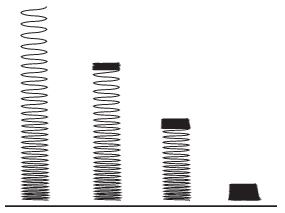

A slinky, a helical spring (used as a toy which is able to travel down a flight of steps) whose unstretched length is negligibly small, obeys Hooke's law with a good approximation, and it has a considerable elongation due to its own weight.

 a ) The slinky of mass m resting on the table is slowly raised at its top end until its lower end just raised from the table. The length of the spring at this position is  L . How much work was done during lifting the spring?
 b ) If the slinky is released from this position, interestingly its lowermost turn does not move until the whole spring reaches its totally compressed length, (see the figure ). What is the initial speed of the slinky at which it begins to fall right after reaching its totally compressed position?
 (6 pont)

