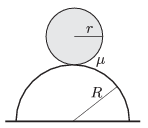

A uniform density sphere of radius r =10 cm rolls down with zero initial speed from the top of a hemisphere of radius R =2 r . The hemisphere is fixed to a horizontal plane. The coefficient of friction between the two spheres is =0.2.

 a ) Where will the rolling sphere begin to slip?
 b ) What is the speed of the centre of the sphere at the moment when it begins to slip?
 (5 pont)

