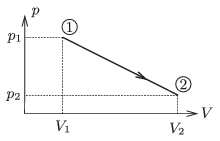

A sample of ideal gas is taken through the process shown in the figure. At its initial state V $_{1}$=2 dm$^{3}$, p $_{1}$=10$^{5}$ Pa, T $_{1}$=300 K. At its final state V $_{2}$=8 dm$^{3}$, p $_{2}$=2.5$^{.}$10$^{4}$ Pa. What is the highest temperature of the gas during the process and at which state is it reached?

 (4 pont)

