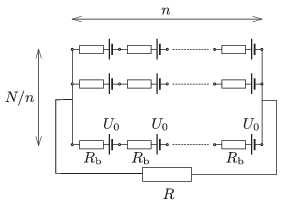

N =100 alike galvanic cells are connected to form a battery as shown in the figure. The electromotive force of each cell is  U $_{0}$, and each of them has an internal resistance of  R $_{b}$. How should the cells be arranged in order that the dissipated power at an external load of resistance R is the greatest, if
 a )  R = R $_{b}$;
 b )  R =4 R $_{b}$;
 c )  R =5 R $_{b}$?

 (5 pont)

