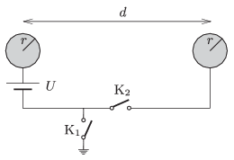

There are two alike initially uncharged spheres of radius r at a distance of d r , as shown in the figure.

 a ) Switch is closed. What is the force exerted between the two spheres?
 b ) What would be the force between the two spheres, if in the previous experiment instead of closing switch , switch was closed?
 c ) Determine the force exerted between the spheres if both switches are closed.
 (6 pont)

