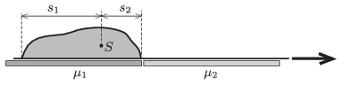

A sack of sand is lying on a light carpet on a horizontal surface. With the help of the carpet the sack of mass $M$ is to be pulled from a smooth surface to a rough one. How much work is done if the coefficients of kinetic friction between the surfaces and the carpet are: $\mu_1$, and $\mu_2$? The weight of the sack is not uniform, but we know that the centre of mass of the sack is at a distance of $s_1$, and $s_2$ from the ends of the bag.

 (5 pont)

