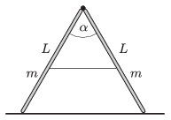

A step ladder is placed to the smooth horizontal surface of ice. The cross section of the ladder is the same everywhere and the angle between its legs is $\alpha=60^\circ$. The hinge which connects the two legs of mass 5 kg and of length of 2 m is frictionless. The thin, initially tight safety rope breaks.

 $a)$ What is the angle between the legs of the ladder, when the hinge does not exert any force?
 $b)$ What is the force exerted on the ice by the ladder at this moment?
 $c)$ At what speed does the hinge hit the ice?
 (5 pont)

