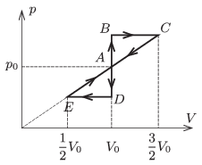

The working substance of a heat engine is a sample of monatomic ideal gas of specific mass. The gas may be taken through the cyclic process $ABCA$ or $ADEA$ as shown in the figure. What is the ratio of the two efficiencies?

 (5 pont)

