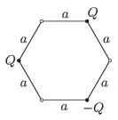

At two vertices of a regular hexagon of side $a=12$ cm, there are two charges of charge $Q=6.4\cdot10^{-8}$ C, and at a third vertex there is a charge of $-Q$ , as shown in the figure. What is the direction and the magnitude of the electric field strength at the centre of the hexagon and at those vertices at which there is no charge?

 (4 pont)

