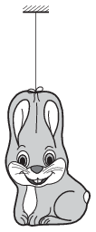

A chocolate bunny wrapped into aluminium foil is suspended by a piece of insulating chord and is charged. The bunny slowly looses its charge due to the conducting ability of air. During the discharging process, what is the magnetic field around the bunny like? (It can be assumed that the conducting ability of air is the same everywhere.)

 (6 pont)

