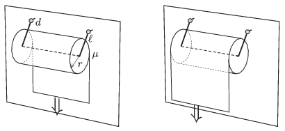

A roll of paper of radius $r=55$ mm is fixed to the wall of the bathroom. The roll is held by a frame of wire with two hinges, such that the hinges are at the same height and are at a distance of $d=15$ mm from the wall. The two side edges of the frame both has the length of $\ell=90$ mm, and this is the distance between the hinges and the axis of the paper roll. The paper roll can be rotated about the middle part of the frame with negligible friction. Due to its weight the structure touches the wall when it is at rest. The coefficient of friction between the tiles of the wall and the paper is $\mu=0.2$. The end of the paper is pulled at a uniform downward speed.
 $a)$ In which case is it necessary to exert a greater force, if the free end of the paper is next to the wall, or if it is further away from the wall?
 $b)$ What is the ratio of the two forces?
 $c)$ What is this ratio if the radius of the paper roll is $r=100$ mm?

 (5 pont)

