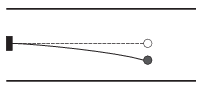

An object of mass 0.1 g is fixed to the end of a thin, initially horizontal quartz thread. The declination of the thread is 0.2 mm. The structure is placed into the space between the horizontal plates of a capacitor as shown in the figure. The distance between the plates is 3 cm. The object is given a charge of $10^{-7}$ C.
 $a)$ What should the applied voltage across the plates of the capacitor be in order that the quartz thread gains back its initial undeformed equilibrium position?
 $b)$ The motion of the object is started with turning on the previously calculated voltage across the plates. What is the amplitude and the frequency of the initiated oscillatory motion?

 (4 pont)

