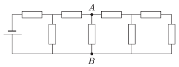

The voltage measured between points $A$ and $B$ in the circuit consisting of eight resistors, each having a resistance of $100~\Omega$, is $50~V$ .

 What is the power dissipated in the system of eight resistors?
 (4 pont)

