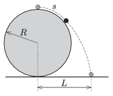

There is a small (point-like) object at the topmost point of a fixed sphere of absolutely smooth surface. If this object is slightly displaced from its equilibrium position it slides frictionlessly along the surface of the sphere for a while, and then leaving the sphere it falls down.

 $a)$ How much distance is covered by the small object along the surface of the sphere until it leaves the sphere?
 $b)$ Measured from the vertical diameter of the sphere, at what distance $L$ will the object hit the horizontal surface?
 The radius of the sphere is $R=1.5$ m.
 (4 pont)

