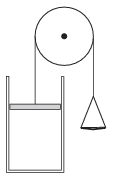

There is a sample of air at standard conditions in the vertical cylinder shown in the figure. The piston moves without friction and its mass is the same as that of the pan on the other side of the pulley. In which case will the movement of the piston be greater, if the same amount of sand is poured to the top of the piston or into the pan? (The temperature remains the same.)

 (4 pont)

