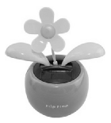

The solar powered Flip Flap, which resembles to a plant with seesawing leaves, is a well known toy. Observing the toy it can be seen that the small plastic flower emerging from a plastic pot is moving left and right, while the two plastic leaves bounces up and down. When the flower is at its furthest position to the right the leaves are at their lowermost point and when the flower is at its left extreme position the leaves are at their uppermost position.

 The toy is exposed to light and is weighed with very sensitive (ideal) scales. When will the scales show the greatest weight?
 (3 pont)

