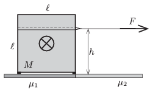

The height of a safe of mass $M=1000$ kg is $\ell=1$ m. The safe has a shape of a cube and it has uniform density. The safe is standing on four small legs, in a garage, next to the door of the garage. The coefficient of friction between the legs of the safe and the rough surface of the tiles of the garage is $\mu_1=0.9$. Outside the garage the ground is a bit smoother, and the coefficient of friction between the ground and the legs is $\mu_2=0.5$.

 The carrier team uses a horizontal cable at a height of $h$ , and an engine driven winch, to pull out the safe from the garage. The winch (which is to be attached to a strong coloumn) can exert a maximum force of 6000 N. The most-educated (from physics) member of the team states that a stronger winch should be used, because if the weight of the safe is multiplied by the average of the coefficients of friction 7000 N is gained, which exceeds the maximum load of the winch, even if at the beginning with the help of some muscle force two legs of the safe is slid to the smoother ground.
 Is the ``Physicist'' of the team right?
 (5 pont)

