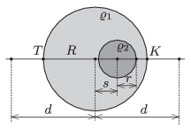

The density of a uniform sphere of radius $R$ is $\varrho_1$, except for a smaller spherical region at which the density is $\varrho_2$ The distance between the centres of the two spheres is $s$ .

 $a)$ What is the acceleration due to gravity along the line which joins the centres of the spheres at a point which is at a distance of $d\ge R$ from the centre of the greater sphere?
 $b)$ Let $s=R/2$ and $r=R/4$ be. In this case the acceleration due to gravity at point $K$ is 10% greater then at point $T$ shown in the figure. What is the ratio of $\varrho_2/\varrho_1$?
 (4 pont)

