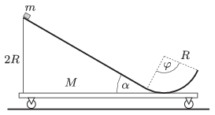

The figure shows an easily moveable cart, on the top of which there is a slope of angle of elevation of $\alpha=30^\circ$, which ends in a circular path. The total mass of the cart with the slope is $M=0.5$ kg. The path is frictionless everywhere. A small pointlike object of mass $m=0.3$ kg is placed to the top of the slope, which has a height of $2R$ , and is released without pushing it to any direction.

 $a)$ What will the displacement, the velocity and the acceleration of the small object and the cart be, when the small object is at the top of its ascending motion if the central angle of the circular path is $\varphi=120^\circ$?
 $b)$ What will the displacement and the velocity of the small object and the cart be at the moment when the small object leaves the circular path if $\varphi=90^\circ$?
 (5 pont)

