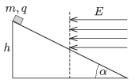

A small object of mass $m$ and of charge $q$ slides down frictionlessly along a slope of angle of elevation $\alpha$ from a height of $h$ . From the midpoint of the slope, it enters into a region of uniform horizontal electric field, and it decelerates and stops at the bottom of the slope. Determine the magnitude of the electric field strength $E$ .

 (4 pont)

