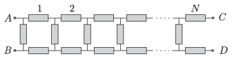

The chain of resistors made of $3N$ resistors as shown in the figure can be closed in two different ways.

 $a)$ The terminals at points $A$ and $C$ are connected and also the terminals at point $B$ and $D$ are connected.
 $b)$ The terminals at points $A$ and $D$ are connected and also the terminals at $B$ and $C$ are connected. (Möbius band.)
 In which case will the equivalent resistance of the system between $A$ and $B$ be greater?
 (6 pont)

