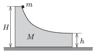

The object of mass $M=4m$ , shown in the figure can freely slide along the horizontal. The curved part of its surface is horizontal at its right side. A small body of mass $m$ is placed to the object of mass $M$ at a height of $H$ , measured from the horizontal tabletop, and then the system is released. When the small object of mass $m$ hits the table the two objects are at a distance of $d=0.6$ m. Friction is negligible everywhere and $h=0.2$ m.

 $a)$ What are the speeds of the two objects at the moment when the small one of mass $m$ leaves the big one of mass $M$ ?
 $b)$ At what speed does the small object hit the table?
 $c)$ Calculate the height $H$ .
 (4 pont)

