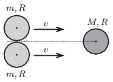

Two alike discs of mass $m$ and of radius $R$ touch each other and move with the same velocity perpendicularly to the line segment which joins their centres of mass, along the surface of a horizontal air-cushioned tabletop. There is a third disc of mass $M$ and of radius $R$ at rest, at a point on the perpendicular bisector of the line segment joining the centres of mass of the two moving discs. The two moving discs collides totally elastically with the third one, which is at rest. There is no friction between the rims of the discs.

 $a)$ If $M=m$ , what will the speed of the discs be after the collision and what is the direction of their motion?
 $b)$ What should the ratio of $M/m$ be in order that after the collision the two discs of mass $m$ move perpendicularly to their initial velocity?
 (5 pont)

