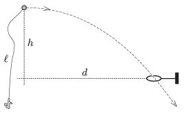

One end of a thread of length $\ell$ is attached to a heavy iron ball, whilst the other end of the thread a feather is fixed, and the ball is projected in the horizontal direction. The ball flies through the metal ring shown in the figure. How long does it take for the thread to pass the metal ring?

 Data: $\ell=1.6$ m, $h=1.25$ m, $d=2$ m.
 (5 pont)

