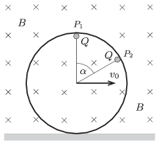

Small balls of charge $Q$ are attached to the points $P_1$ and $P_2$ of a ring, made of some insulating material, moving in a vertical plane, such that $\alpha=60^\circ$. The ring is in a homogeneous magnetic field of induction $B$ , the magnetic field lines are perpendicular to the plane of the ring. The ring is moved such that it rolls without skidding on the horizontal surface which is also made from some insulating material. The speed of the centre of the ring is $v_0$.

 $a)$ What is the magnitude of the magnetic force exerted on each charge at the position shown in the figure?
 $b)$ At which positions of the ring will the torque of the sum of the magnetic forces calculated about the centre of the ring be zero? Considering only these positions, in which case will the force exerted by the magnetic field on the ring be the greatest and what is this greatest force?
 $c)$ Determine the intersection of the lines of action of the magnetic forces.
 (5 pont)

