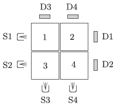

Four concrete cubes, which are made of different material, and which all have the side of 10 cm are placed next to each other as shown in the figure. They are ``illuminated'' by a beam of ${}^{60}$Co gamma-ray, from four different positions, (S1, S2, S3 and S4) one after the other. Opposite to the gamma source behind the cubes there are four detectors (D1, D2, D3 and D4). The first three measurements shows that the concrete cubes decrease the intensity of the radiation by 86.76, 71.94 and 84.25 percent of the original value, respectively.

 $a)$ What is the intensity of the radiation measured by the fourth detector, expressed in the percentage value of the intensity of the original radiation?
 $b)$ The ``thickness of the halving-layer'' of the first cube is 6 cm. What is this value for the other cubes (which is characteristic of the material of the cube)?
 (5 pont)

