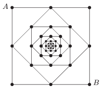

The resistance of each pieces of wire between the points indicated by the black circles in the arrangement (the pattern continues infinitely towards the centre) shown in the figure is $1~\Omega$.

 What is the equivalent resistance between the points $A$ and $B$ ?
 (6 pont)

