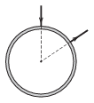

To which two points of a uniform density and uniform cross section copper ring should an electrical voltage supply be connected in order that the magnetic flux density induced by the current in the ring is to be zero at the centre of the ring?

 (4 pont)

