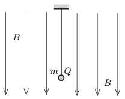

A small ball of mass $m$ and of charge $Q$ is hanging on a piece of thread in uniform vertical magnetic field of magnetic induction $B$ . The ball is given an initial velocity such that it undergoes uniform circular motion in a horizontal plane. At another occasion the ball is started such that it moves in the magnetic field along the same radius of circle in the horizontal, but in the opposite direction as it did in the previous case.

 $a)$ Determine the ratio of the two tensions in the thread in the two cases.
 $b)$ What is the difference between the magnitudes of the angular speeds of the two motions?
 (4 pont)

