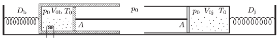

There are two cylinders of cross section $A=2~\rm{dm}^2$ at rest on a frictionless, horizontal surface. The pistons of the cylinders can move easily and they are connected with a rigid rod. Each cylinder is connected to an unstretched spring. The values of the spring constant of the springs are $D_{\rm b}=24$ kN/m, and $D_{\rm j}=16$ kN/m. The volume of the air enclosed in the left, insulated cylinder is $V_{\rm 0b}=20~{\rm dm}^3,$ and that of in the right cylinder is $V_{\rm
0j}=30~{\rm dm}^3$, and the initial temperature of both gases is $T_0=300$ K. The temperature of the gas in the left cylinder is increased to $T_{\rm b}=1200$ K. The ambient air pressure is $p_0=10^5$ Pa.

 $a)$ What is the displacement of the two cylinders and the piston with respect to the ground if the temperature of the gas in the right cylinder is kept at its initial value?
 $b)$ What are the final values of the volume of the two samples of gas?
 $c)$ How much heat was released by the heating element which heated the gas in the left cylinder?
 (5 pont)

