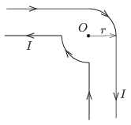

Current $I$ in the wires shown in the figure flows in the direction of the arrows. (The wire forms two rays and two circular arcs of radius $r$ and of central angle $90^\circ$.) What is the magnitude of the magnetic flux density $\boldsymbol
B$ at point $O$ which is the common centre of the circles?

 (4 pont)

