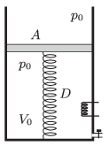

There is a sample of ideal gas in a vertical cylinder, which is closed at its lower base. At the top there is a massless frictionlessly moveable piston. The volume of the sample of ideal gas is $V_0=8~\rm dm^3$, and its pressure is the same as the ambient air pressure, which is $p_0=10^5$ Pa. The piston is attached to the bottom of the cylinder with a spring of spring constant $D=1000$ N/m. The area of the bottom of the cylinder is $A=2~\rm dm^2$. During a physics experiment the mass of the gas is increased by 50% through a tap on the cylinder, and by heating the absolute temperature of the gas is increased by 60%. Determine the volume and the pressure of the gas after these changes.

 (4 pont)

