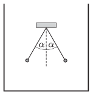

Two insulating threads, which have the same lengths, are suspended at the same point and at their lower end of each, there is a small ebony ball attached. The balls are given the same amount of like charges. The angle between the threads is $2\alpha=60^\circ$ when the pendulums are inside a container at rest in air. Then the container is filled with petroleum, such that both balls are in the petroleum, far from the walls of the container and from the surface of the liquid. What is the angle between the threads now?

 Data: The density of ebony is $1200~{\rm
kg}/{\rm m^3}$, the density of petroleum is $820~{\rm kg}/{\rm m^3}$. The relative dielectric constant of petroleum is $\varepsilon_{\rm r}=2$.
 (5 pont)

